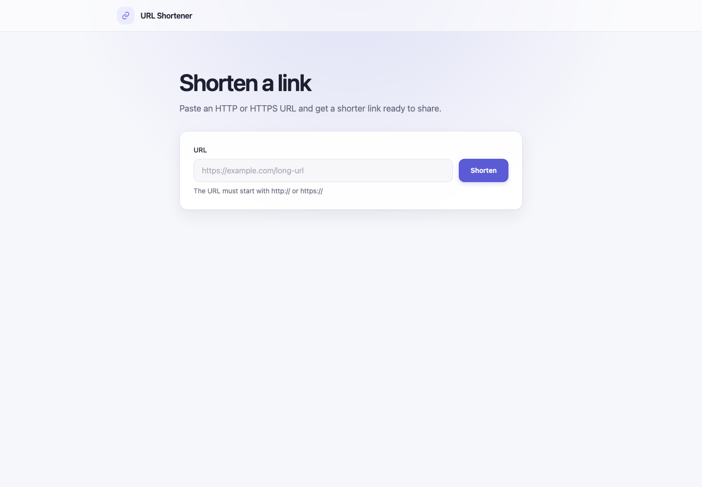

# URL Shortener

[](https://github.com/AliciaVillemat/url-shortener/actions/workflows/quality.yml)

A small full-stack URL shortener built with React, NestJS, Prisma, and SQLite. It accepts HTTP and HTTPS URLs, creates case-sensitive seven-character short codes, and serves real HTTP `302` redirects.



## Features

- Client- and server-side URL validation
- Cryptographically generated Base62 codes
- Persistent SQLite storage through Prisma
- Copy and open-link actions with accessible feedback
- Responsive, keyboard-friendly React interface
- Consistent API errors and an isolated integration test database
- Bruno collection for manual API verification

## Prerequisites

- Node.js `>=24.16.0 <25` — `24.16.0` is pinned in [`.nvmrc`](./.nvmrc) as the reference version
- pnpm `10.17.1` — pinned in [`package.json`](./package.json)

nvm is optional. Node.js can be installed directly or managed with another tool such as fnm, Volta, asdf, or mise. The project only requires a version compatible with the range above.

To reproduce the exact development environment with nvm, run:

```bash
nvm install
nvm use
```

Without nvm, verify the installed versions before continuing:

```bash
node --version
pnpm --version
```

## Installation

```bash
git clone https://github.com/AliciaVillemat/url-shortener.git
cd url-shortener
cp .env.example .env
pnpm install --frozen-lockfile
pnpm run setup
```

`pnpm run setup` creates the local SQLite file, generates the Prisma client, and applies the versioned migrations. The database and generated client are local artifacts and are not committed.

## Running locally

Start the API and web application together:

```bash
pnpm dev
```

The default local addresses are:

- Web application: <http://localhost:5173>
- API health check: <http://localhost:3001/api/health>
- Short redirects: `http://localhost:3001/:code`

The development process runs both workspace applications in watch mode. Stop it with `Ctrl+C`.

## Environment variables

Copy [`.env.example`](./.env.example) to `.env`. The local `.env` file is ignored by Git.

| Variable            | Default                 | Purpose                                   |
| ------------------- | ----------------------- | ----------------------------------------- |
| `DATABASE_URL`      | `file:./dev.db`         | SQLite database used by Prisma            |
| `PUBLIC_BASE_URL`   | `http://localhost:3001` | Prefix returned for generated short URLs  |
| `WEB_ORIGIN`        | `http://localhost:5173` | Only browser origin allowed by API CORS   |
| `PORT`              | `3001`                  | API listening port                        |
| `VITE_API_BASE_URL` | `http://localhost:3001` | API base URL compiled into the web client |
| `VITE_WEB_PORT`     | `5173`                  | Vite development and preview port         |

Related values must remain aligned:

- Changing the API port requires updating `PORT`, `PUBLIC_BASE_URL`, and `VITE_API_BASE_URL`.
- Changing the web port requires updating `VITE_WEB_PORT` and `WEB_ORIGIN`.

Vite uses strict port selection. If `VITE_WEB_PORT` is occupied, startup fails instead of silently selecting a port that would conflict with CORS configuration.

## API

### Create a short link

```http
POST /api/links
Content-Type: application/json

{
  "url": "https://www.example.com/some/long/path"
}
```

Successful response (`201`):

```json
{
  "code": "aB3xYz7",
  "originalUrl": "https://www.example.com/some/long/path",
  "shortUrl": "http://localhost:3001/aB3xYz7",
  "createdAt": "2026-07-17T08:30:00.000Z"
}
```

### Redirect

```http
GET /:code
```

Known codes return `302` with the original URL in the `Location` header. Unknown or malformed codes return a JSON `404`; they never fall through to the frontend.

### Health check

```http
GET /api/health
```

## Commands

Run these commands from the repository root:

| Command             | Description                                                |
| ------------------- | ---------------------------------------------------------- |
| `pnpm run setup`    | Prepare SQLite, generate Prisma, and apply migrations      |
| `pnpm dev`          | Start the API and web development servers                  |
| `pnpm format`       | Format tracked source and documentation files              |
| `pnpm format:check` | Check formatting without modifying files                   |
| `pnpm lint`         | Run ESLint in both applications                            |
| `pnpm typecheck`    | Type-check the API and web workspaces                      |
| `pnpm test`         | Run backend integration tests and frontend component tests |
| `pnpm build`        | Build both applications for production                     |

For interactive frontend test development, run:

```bash
pnpm --filter @url-shortener/web test:watch
```

## Testing

The backend Jest/Supertest suite uses a disposable SQLite database, applies the real Prisma migration, runs serially, and removes the database afterward. It covers validation, persistence, redirects, unknown codes, Base62 formatting, repeated URLs, and a simulated unique-code collision.

The frontend Vitest and Testing Library suite runs in jsdom. It covers URL validation, form submission, loading, API errors, rendered results, and clipboard success and failure.

A Bruno 3+ collection is available in [`bruno/`](./bruno). Open that directory in Bruno and select the `Local` environment. Run `Create HTTPS link` before `Redirect last created link` so the generated code is captured automatically.

## Architecture

```text
.
├── apps/
│   ├── api/                 # NestJS REST API, Prisma, SQLite, Jest/Supertest
│   └── web/                 # React, Vite, Tailwind CSS, Vitest
├── bruno/                   # Manual API collection
├── docs/                    # Repository images
├── .github/workflows/       # Continuous integration
├── .env.example
├── package.json             # Root workspace commands
├── pnpm-lock.yaml
└── pnpm-workspace.yaml
```

The browser sends `POST /api/links` to the NestJS API. The controller validates the DTO, the service performs URL and code-generation rules, and Prisma persists the link. `GET /:code` reads the destination through the same service and returns a `302` redirect.

The backend intentionally stays close to NestJS conventions: controllers handle HTTP, services contain business rules, and Prisma owns persistence. There is no generic repository or shared package because neither adds value at this size.

## Technical choices

- **Seven-character Base62 codes:** generated with Node.js `crypto.randomInt`, case-sensitive, and protected by a database `UNIQUE` constraint.
- **Collision handling at insertion:** a conflicting insert generates a new code and retries, up to five attempts. There is no race-prone preflight lookup.
- **SQLite and Prisma:** keep local setup small while retaining a typed client and versioned migration.
- **HTTP `302`:** avoids permanent browser caching and leaves room for editable destinations in a future version.
- **Validation on both sides:** client validation improves feedback; server validation remains authoritative.
- **No server-side URL fetch:** submitted destinations are parsed and stored but never visited, avoiding an unnecessary SSRF surface.
- **Explicit ports:** predictable configuration is preferred over runtime port discovery, which would also need to synchronize CORS and public URLs.

## Product decisions and assumptions

- A protocol is required; only `http:` and `https:` are accepted.
- URLs are limited to 2,048 characters.
- Repeated submissions of the same URL create distinct codes. This keeps the model simple and allows future links to have independent analytics or expiration dates.
- URLs are not aggressively normalized or deduplicated.
- The MVP has no authentication, ownership, analytics, custom aliases, editing, expiration, or deletion.
- A single public base URL and one expected web origin are configured per environment.
- The application stores destinations but does not verify that they are reachable or safe.
